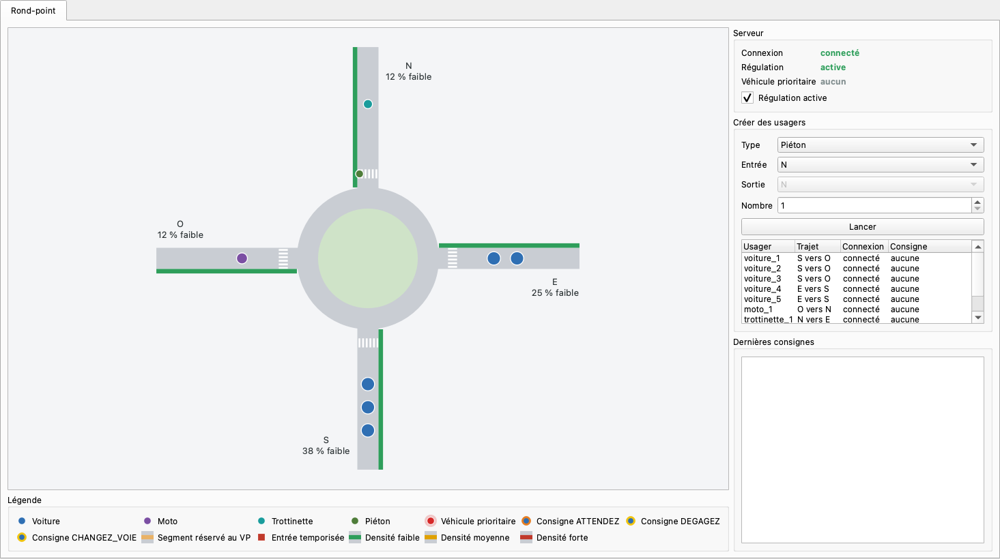
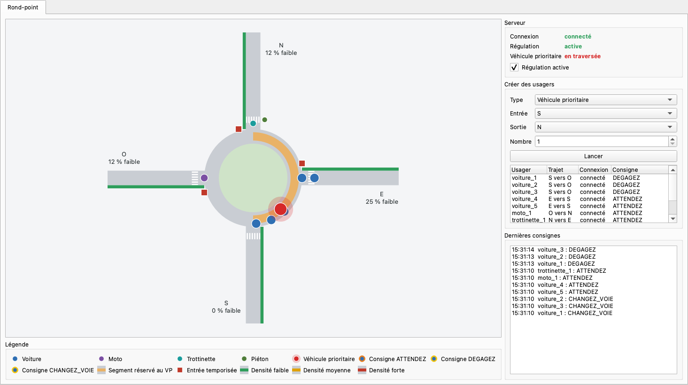
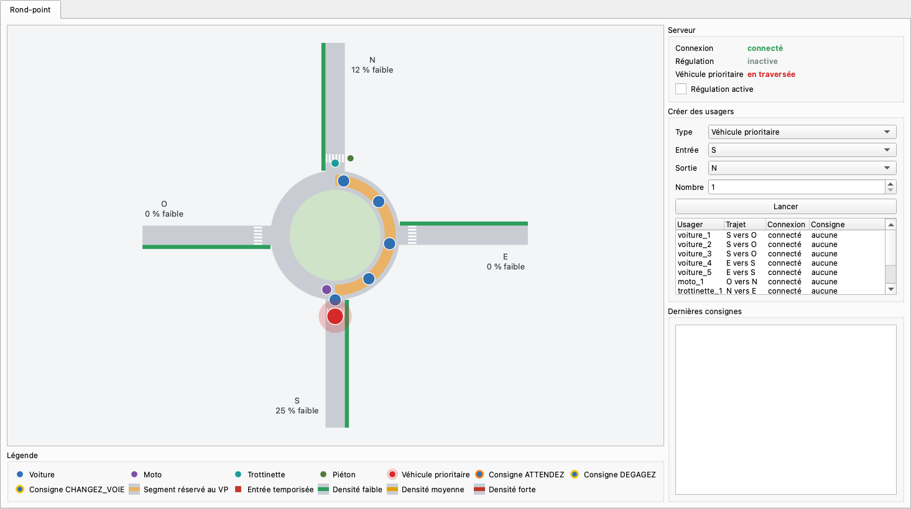

# CherryPie : rond-point connecté

Projet de la SAÉ 3.02 « Développer une application communicante » (BUT R&T, IUT de Colmar).

Maquette logicielle du rond-point sans feux situé vers l'arrêt Bel Air, à Mulhouse. Tous les usagers (voitures, motos, trottinettes, piétons et véhicules prioritaires) sont connectés à un serveur qui représente le rond-point. Le but est de faire traverser un véhicule prioritaire le plus vite et le plus sûrement possible, en demandant aux autres usagers de lui laisser le passage.

L'application se découpe en trois parties :

- le **serveur**, qui tient le registre des usagers, calcule la densité de chaque branche et envoie les consignes ;
- les **clients usagers**, qui se déplacent sur le rond-point et suivent ces consignes ;
- la **supervision**, une fenêtre PyQt6 qui affiche le rond-point en 2D, permet de créer des usagers et présente les statistiques.

## Équipe

- Lucas Carriat
- Ilkan Guney

## Prérequis

- Python 3.11 ou plus récent

## Installation

```bash
git clone https://github.com/vRayzix/SAE3.02_Developper-une-application-communicante.git
cd SAE3.02_Developper-une-application-communicante
python3 -m venv .venv
source .venv/bin/activate          # sous Windows : .venv\Scripts\activate
pip install -r requirements.txt
cp config.exemple.ini config.ini   # sous Windows : copy config.exemple.ini config.ini
```

`config.ini` n'est pas versionné : il contient la clé HMAC partagée et les identifiants de la base. Les valeurs d'exemple sont à remplacer.

## Lancer le serveur

```bash
python scripts/lancer_serveur.py                  # lit config.ini à la racine du dépôt
python scripts/lancer_serveur.py autre_config.ini
```

Le serveur écoute en TCP sur le port 5050 et en UDP sur le port 5051 (réglables dans `config.ini`), et journalise dans la console les connexions, les inscriptions et les trames refusées. Ctrl+C ou `kill` l'arrêtent proprement.

Ces ports évitent le 5000, que le récepteur AirPlay occupe déjà sur toutes les interfaces sous macOS.

## Lancer la supervision

```bash
python scripts/lancer_supervision.py                  # lit config.ini à la racine du dépôt
python scripts/lancer_supervision.py autre_config.ini
```

La fenêtre peut être ouverte avant le serveur : elle s'y connecte dès qu'il répond, et s'y reconnecte s'il redémarre. Elle montre :

- le rond-point en 2D, dessiné d'après `config.ini`. Chaque usager est un disque coloré selon sa catégorie et cerclé selon la consigne qu'il suit ; le véhicule prioritaire est plus gros et entouré d'un halo ;
- en orange, les segments de l'anneau réservés au véhicule prioritaire, et un carré rouge au bord de chaque entrée temporisée ;
- la densité de chaque branche, écrite en pourcentage et rendue par la couleur de la bande le long de la voie d'entrée : vert pour faible, jaune pour moyenne, rouge pour forte ;
- l'état de la connexion, la régulation en vigueur sur le serveur et la présence d'un véhicule prioritaire ;
- l'interrupteur « Régulation active », qui active ou coupe la régulation sur le serveur ;
- le panneau de création : on choisit le type d'usager, l'entrée, la sortie (imposée pour un piéton) et le nombre, puis « Lancer » démarre un client par usager, qui se connecte au serveur comme n'importe quel autre ;
- les dernières consignes reçues par ces usagers.

Fermer la fenêtre, ou faire Ctrl+C dans la console, arrête les clients lancés depuis la fenêtre et la connexion au serveur.

### Captures

Les trois captures montrent le même trafic : trois voitures en file au sud, deux à l'est, une moto à l'ouest, une trottinette et un piéton au nord. Le véhicule prioritaire part ensuite du sud vers le nord, et les deux dernières captures sont prises 6 s après son départ.

Avant l'arrivée du véhicule prioritaire :



Avec régulation, les voitures déjà sur l'anneau s'écartent, les entrées qui croisent la trajectoire du véhicule prioritaire sont temporisées, et il roule déjà sur l'anneau :



Sans régulation, il attend encore sur sa branche d'entrée, derrière la file :



`python scripts/generer_captures.py` refait ces images : il lance un serveur et la fenêtre dans le même processus, sans rien afficher à l'écran.

## Tests

```bash
python -m pytest                  # tous les tests, environ 40 s
python -m pytest -m "not lent"    # sans le test de bout en bout, qui joue deux traversées en temps réel
```

## Organisation du dépôt

| Dossier | Contenu |
| --- | --- |
| `src/cherrypie/` | code de l'application : `commun`, `modele`, `serveur`, `client`, `ihm`, `bdd` |
| `tests/` | tests pytest |
| `docs/` | documentation technique : diagramme de classes, protocole, sécurité, captures d'écran |
| `scripts/` | scripts de lancement et de génération des captures |
| `Livrables/` | livrables rendus (QQOQCP, cahier des charges) |
| `RessourcesProjets/` | consignes et ressources fournies pour la SAÉ |
