# Diagramme de classes prévisionnel

Ce document décrit les classes prévues avant le développement. Il sera ajusté au fil de l'avancement, le diagramme final étant celui du code rendu.

Dépendances entre paquets : `commun` ne dépend d'aucun autre paquet ; `modele` utilise `commun` ; `serveur` et `client` utilisent `commun` et `modele` ; `ihm` lance des clients et lit la base ; seul `serveur` écrit dans `bdd`.

## Conventions

| Notation | Signification | En Python |
| --- | --- | --- |
| `-` | privé | attribut `self.__nom` ou méthode `__nom()` |
| `#` | protégé | méthode `_nom()`, réservée à la classe et à ses sous-classes |
| `+` | public | méthode ou propriété sans préfixe |
| souligné | membre de classe | constante de classe, `@classmethod` ou `@staticmethod` |
| `<<dataclass>>` | objet valeur | `@dataclass(frozen=True)`, champs publics en lecture seule |
| `<<enumeration>>` | énumération | sous-classe de `Enum` |

Tous les attributs d'instance sont privés, sauf les champs des objets valeur. Chacun est lu depuis l'extérieur par une propriété `@property` du même nom. Un setter n'existe que si l'attribut doit changer après la construction : il valide la valeur et lève une exception si elle est incohérente. Les setters prévus sont listés sous chaque diagramme. Les constructeurs ne sont pas représentés.

Relations : triangle vide pour l'héritage, losange plein pour la composition (la partie n'existe pas sans le tout), losange vide pour l'agrégation (le tout référence des objets qui existent sans lui), flèche simple pour l'association, flèche pointillée pour une dépendance ponctuelle.

## Paquet `commun`

### Erreurs métier

Toutes les erreurs du projet héritent de `CherryPieError`. Le serveur peut ainsi distinguer une trame refusée, qu'il journalise puis ignore, d'un vrai bug.

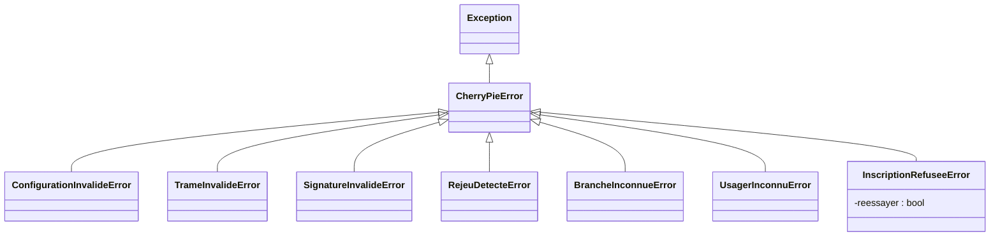

### Configuration, protocole, trames et sécurité

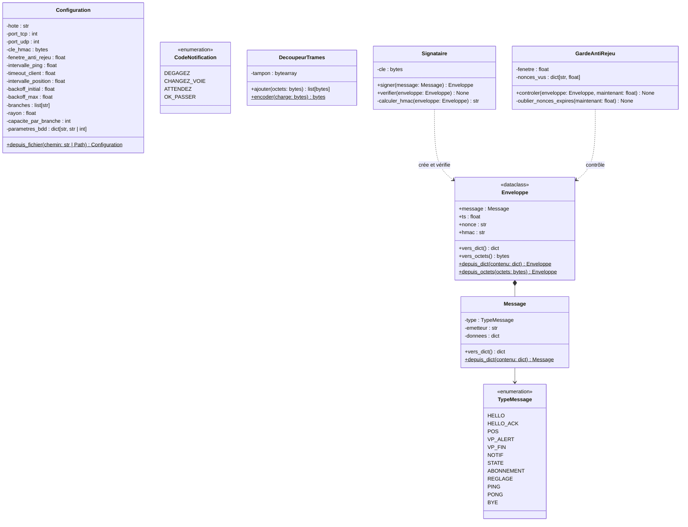

- `Enveloppe` est la forme transmise sur le réseau : le `Message`, plus l'horodatage, le nonce et le HMAC. `Signataire.signer()` la construit ; à la réception, `Signataire.verifier()` puis `GardeAntiRejeu.controler()` la valident.
- `CodeNotification` fait partie du protocole plutôt que du serveur, parce que le client en a besoin pour réagir aux consignes.
- `DecoupeurTrames` tient le tampon d'une socket TCP : `ajouter()` renvoie les trames complètes et garde le reste pour la lecture suivante.

Setters prévus : aucun, ces objets ne changent plus une fois construits.

## Paquet `modele`

### Usagers

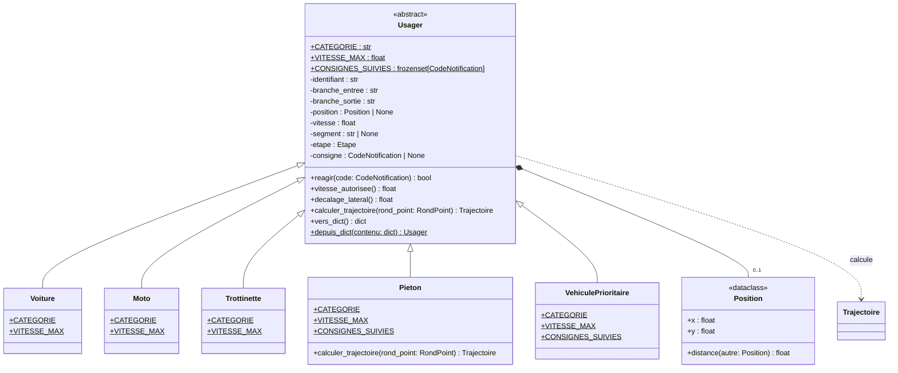

`Usager.reagir()` applique la consigne reçue si elle fait partie de `CONSIGNES_SUIVIES` et renvoie `True` ; sinon il l'ignore et renvoie `False`. Chaque sous-classe redéfinit ce qui lui est propre :

| Classe | Catégorie | Vitesse max | Consignes suivies | Trajectoire |
| --- | --- | --- | --- | --- |
| `Voiture` | `voiture` | 8,3 m/s (30 km/h) | toutes | approche, anneau, sortie |
| `Moto` | `moto` | 8,3 m/s (30 km/h) | toutes | approche, anneau, sortie |
| `Trottinette` | `trottinette` | 5,6 m/s (20 km/h) | toutes | approche, anneau, sortie |
| `Pieton` | `pieton` | 1,4 m/s (5 km/h) | `ATTENDEZ`, `OK_PASSER` | traversée de sa branche |
| `VehiculePrioritaire` | `vp` | 11,1 m/s (40 km/h) | aucune, c'est lui qu'on laisse passer | approche, anneau, sortie |

- `vitesse_autorisee()` et `decalage_lateral()` traduisent la consigne en cours : vitesse réduite de moitié et décalage de 2 m pour `DEGAGEZ`, décalage seul pour `CHANGEZ_VOIE`. `ATTENDEZ` ne change pas la vitesse : l'usager avance jusqu'à la ligne d'entrée de sa trajectoire et s'y arrête. `OK_PASSER` lève la consigne.
- `Pieton` redéfinit `calculer_trajectoire()` : il ne prend pas l'anneau, il traverse une seule branche, qui est à la fois son entrée et sa sortie.
- `depuis_dict()` instancie la bonne sous-classe d'après la catégorie reçue dans le HELLO.
- `Position` a son propre module (`modele/position.py`), partagé par les usagers, le rond-point et les trajectoires. Elle refuse les coordonnées infinies ou NaN.

Setters : `Usager.position`, `Usager.vitesse` (entre 0 et la vitesse maximale de la catégorie), `Usager.segment` et `Usager.etape`, mis à jour par le client quand il avance et par le serveur à chaque POS reçu. L'étape vaut `APPROCHE` tant que l'usager n'a pas bougé.

### Rond-point

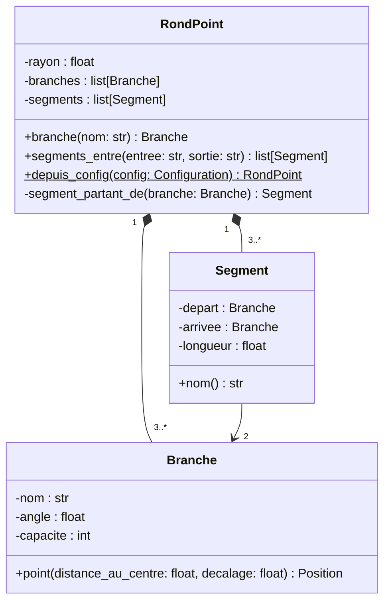

- `RondPoint` crée ses branches et ses segments à partir de la configuration, et ils n'existent pas sans lui : composition.
- Les branches sont réparties régulièrement autour de l'anneau. La première est placée au nord, les suivantes dans le sens des aiguilles d'une montre : N, E, S et O tombent à leur place.
- Les segments suivent le sens de circulation, inverse des aiguilles d'une montre : `segments_entre("S", "N")` renvoie S-E puis E-N. Si l'entrée et la sortie sont la même branche, l'usager fait le tour complet.
- `RondPoint.branche()` lève `BrancheInconnueError` pour un nom qui n'existe pas.

Setters : aucun, la géométrie ne change plus une fois le rond-point construit.

### Trajectoires

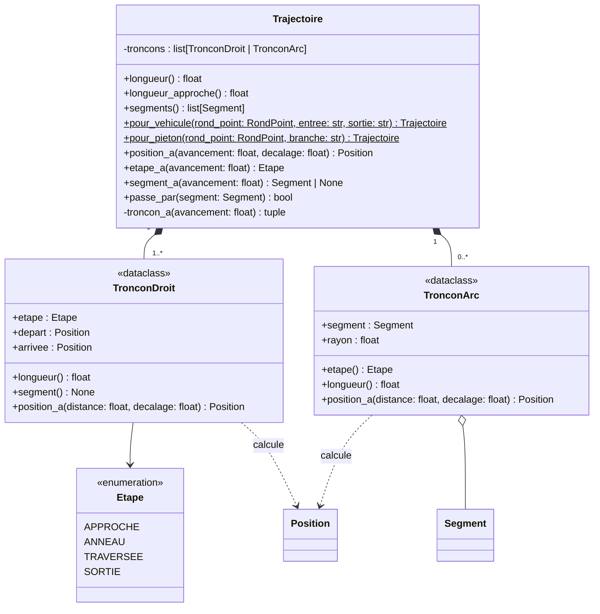

- Une trajectoire est une suite de tronçons parcourus l'un après l'autre : des tronçons droits sur les branches (approche, sortie, passage piéton) et des arcs sur l'anneau, un par segment. Les deux types de tronçons offrent les mêmes membres (`etape`, `longueur`, `segment`, `position_a()`) : la trajectoire trouve le tronçon qui correspond à l'avancement et lui délègue le calcul.
- L'avancement est la distance parcourue depuis le départ. `longueur_approche` donne la position de la ligne d'entrée, où s'arrête un usager qui a reçu `ATTENDEZ`. Un point situé pile à la jonction de deux tronçons appartient au premier : un usager arrêté sur la ligne est encore en approche.
- Un véhicule parcourt 50 m d'approche, les segments de l'anneau, puis 50 m de sortie. Un piéton parcourt 4 m de trottoir jusqu'au bord de la chaussée, traverse les 7 m du passage piéton, placé à 8 m de l'anneau, puis repart sur le trottoir d'en face : il croise l'approche des véhicules de cette branche.
- Le décalage latéral se compte vers la droite du sens de marche ; sur l'anneau, c'est l'extérieur.
- Les arcs ne font que référencer les segments du rond-point, sans les posséder : agrégation.

Setters : aucun, une trajectoire ne change plus une fois calculée.

## Paquet `serveur`

### Boucle réseau et logique

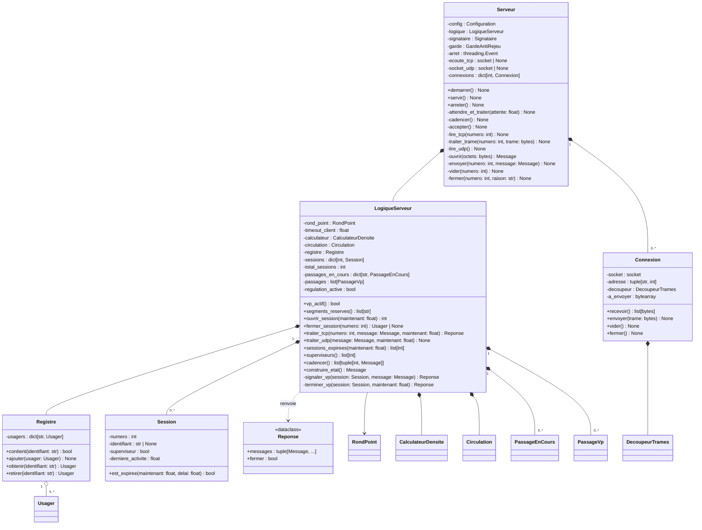

- La boucle réseau et la logique sont séparées. `Serveur` ne décide rien ; `LogiqueServeur` ne touche aucune socket, ce qui permet de la tester sans réseau. Elles se parlent par numéro de session : la boucle associe chaque numéro à une `Connexion` (la socket et ses tampons), la logique à une `Session` (usager, abonnement, dernière activité).
- `servir()` fait tourner une seule boucle `select` sur la socket d'écoute TCP, la socket UDP et les sockets des clients. Son délai d'attente court jusqu'à la prochaine cadence (`intervalle_etat`) : à chaque cadence, `cadencer()` ferme les sessions silencieuses et envoie le STATE aux supervisions. `arreter()` lève un `threading.Event` vérifié à chaque tour, ce qui arrête la boucle en moins d'un intervalle.
- Chaque trame reçue passe par `ouvrir()` (enveloppe, HMAC, anti-rejeu) avant d'être confiée à la logique. Une trame refusée est journalisée puis ignorée.
- `Connexion` utilise une socket non bloquante. Son découpeur recolle les trames reçues en plusieurs morceaux ou collées ensemble, et sa file d'envoi garde ce que la socket n'a pas pu accepter, jusqu'à ce que `select` la signale prête à écrire. Un client qui laisse plus de 1 Mio en attente est déconnecté.
- Aux frontières, une erreur imprévue sur une session ne ferme que cette session ; ailleurs dans la boucle, elle est journalisée et la boucle continue.

Setters : `Session.identifiant` (une seule fois, au HELLO), `Session.superviseur` (à l'ABONNEMENT) et `Session.derniere_activite` (à chaque message reçu, jamais en arrière).

### Densité et véhicules prioritaires

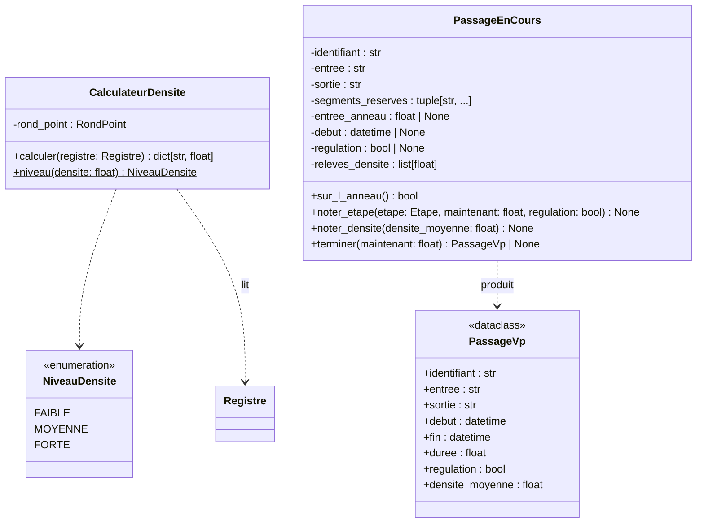

- `CalculateurDensite` compte, pour chaque branche, les usagers en approche sur cette branche (ceux qui roulent vers l'anneau ou attendent d'y entrer) et divise par sa capacité, en bornant à 1. `niveau()` applique les seuils du cahier des charges : faible en dessous de 0,4, moyenne en dessous de 0,7, forte au-delà.
- Un VP_ALERT crée un `PassageEnCours`, qui réserve les segments de la trajectoire du VP. Le premier POS du VP sur l'anneau démarre le chronomètre, et `cadencer()` y relève la densité moyenne des branches à chaque cadence. Le VP_FIN produit un `PassageVp`, une mesure figée que `LogiqueServeur.passages` conserve pour l'enregistrement en base.
- `cadencer()` regroupe ce que la logique fait à chaque cadence : relevés de densité, puis un STATE par supervision. La boucle réseau n'a plus qu'à envoyer ce qu'elle renvoie.

### Ce que voit chaque conducteur

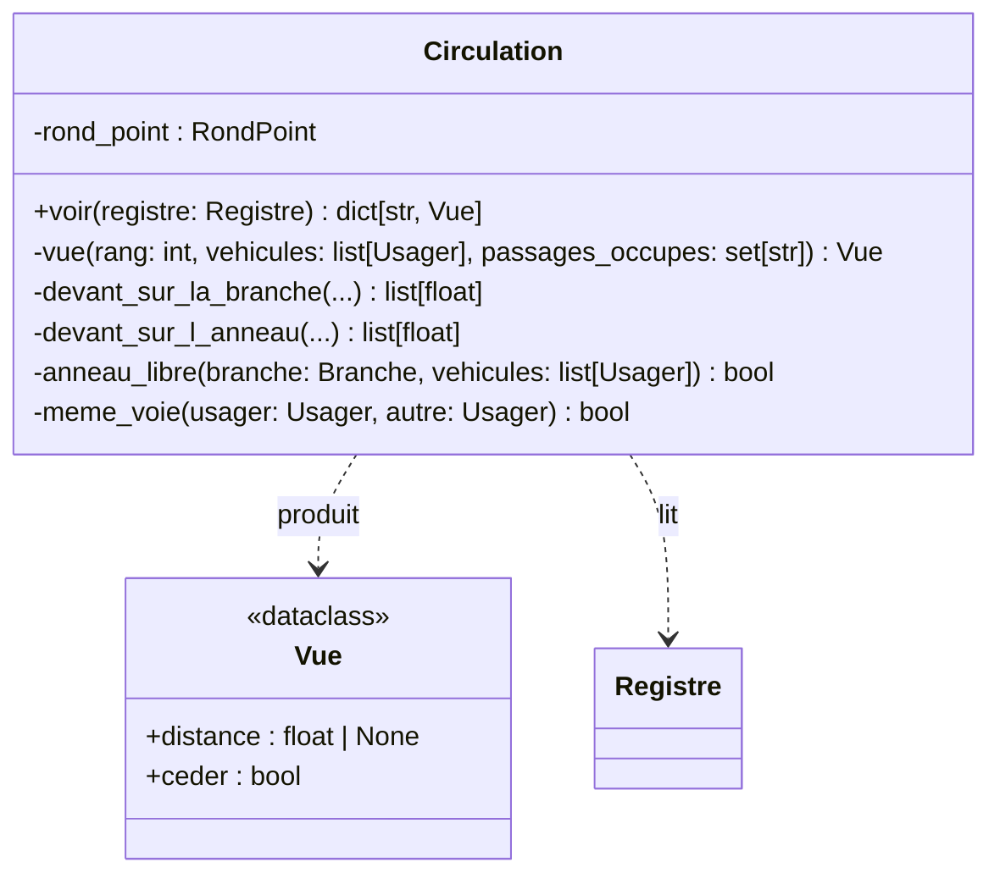

- Chaque client roule sans voir les autres. `Circulation.voir()` calcule, pour chaque véhicule dont la position est connue, la distance jusqu'à l'obstacle le plus proche devant lui sur sa voie (autre véhicule ou piéton sur le passage) et s'il doit céder le passage. `cadencer()` l'envoie à chaque véhicule dans un message DEVANT, que la régulation soit active ou non : c'est la simulation de ce que voit un conducteur, pas une consigne.
- Deux véhicules sont sur la même voie si leurs décalages latéraux diffèrent de moins d'un mètre : un usager rangé sur le côté ne gêne pas ceux qui roulent au milieu.
- Le cédez-le-passage demande 15 m libres en amont et 10 m en aval du point d'entrée, ce qui empêche l'anneau de se bloquer en boucle.

### Régulation (prévue)

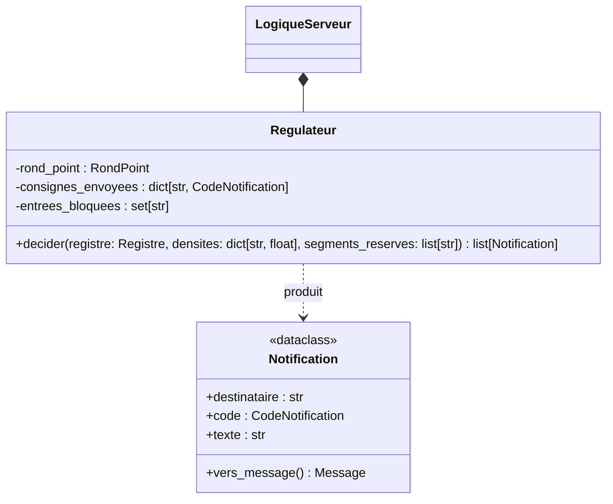

- `Regulateur.decider()` sera appelé à chaque cadence. Il comparera la situation (VP en cours, densités, étape des usagers) aux consignes déjà envoyées et ne renverra que les nouvelles notifications. Quand la régulation est désactivée, il ne renverra rien.

Setters prévus : `LogiqueServeur.regulation_active` (message REGLAGE).

## Paquet `client`

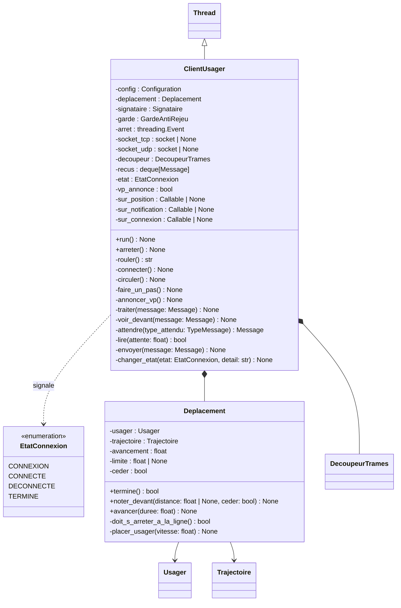

- Chaque `ClientUsager` est un `threading.Thread` avec ses propres sockets. Il ne dépend pas de Qt : il signale sa position, les consignes reçues et l'état de sa connexion par trois fonctions de rappel, appelées depuis son thread. L'IHM les reliera à des signaux Qt, sans que le client touche jamais un widget. La position est transmise sous forme de copie (`Usager.vers_dict()`), jamais par l'objet partagé.
- `rouler()` enchaîne les connexions. Après une coupure, ou un refus provisoire (`InscriptionRefuseeError.reessayer`), il attend avec un délai qui double (1, 2, 4, 8 s, plafonné à 10 s). L'attente se fait sur un `threading.Event` : `arreter()` réveille le client sans attendre la fin du délai. Un refus définitif l'arrête.
- `circuler()` fait avancer l'usager d'un pas à chaque intervalle de position, envoie le POS en UDP, envoie un PING toutes les `intervalle_ping` secondes et traite les messages reçus. Elle s'arrête si le serveur reste muet plus de `timeout_client` secondes, et dit au revoir (BYE) à la fin du trajet ou à l'arrêt.
- Les messages lus attendent dans une file (`recus`) : une NOTIF arrivée dans la même lecture que le HELLO_ACK n'est pas perdue.
- `Deplacement` contient les règles de mouvement, sans réseau, ce qui permet de les tester seules. À chaque pas, l'usager parcourt la distance que permet sa consigne et s'arrête sur la ligne d'entrée pendant un ATTENDEZ ou un cédez-le-passage s'il ne l'a pas encore franchie. Le décalage et le ralentissement viennent de `reagir()`. `noter_devant()` fixe l'avancement à ne pas dépasser pour garder 6 m avec l'obstacle de devant ; l'usager ne recule jamais.
- Un client de VP envoie VP_ALERT à chaque connexion tant que le VP n'a pas quitté l'anneau, avec son `eta` (le temps qu'il lui faut pour atteindre l'anneau), puis VP_FIN au pas où il passe en étape de sortie.

Setters prévus : aucun.

## Paquets `ihm` et `bdd`

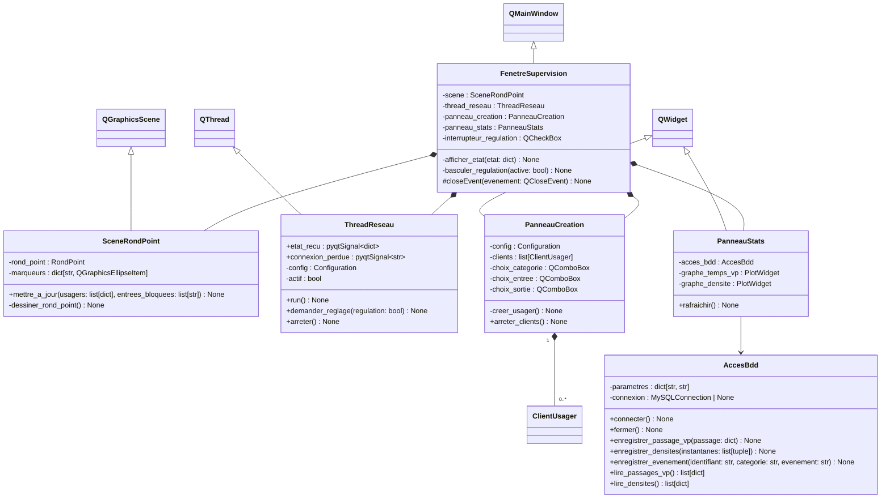

- `ThreadReseau` ne touche aucun widget. Il reçoit les STATE et émet `etat_recu` ; c'est `FenetreSupervision`, dans le thread graphique, qui met la scène à jour dans `afficher_etat()`.
- `closeEvent()` redéfinit la méthode protégée de Qt pour arrêter proprement le thread réseau et les clients lancés avant de fermer la fenêtre.
- `PanneauCreation` lance un `ClientUsager` local pour la catégorie, l'entrée et la sortie choisies. Ce client se connecte au serveur comme n'importe quel autre.
- `AccesBdd` utilise des requêtes paramétrées et `executemany` pour les instantanés de densité. Le serveur est le seul à écrire ; `PanneauStats` ne fait que lire.

Setters prévus : aucun.
