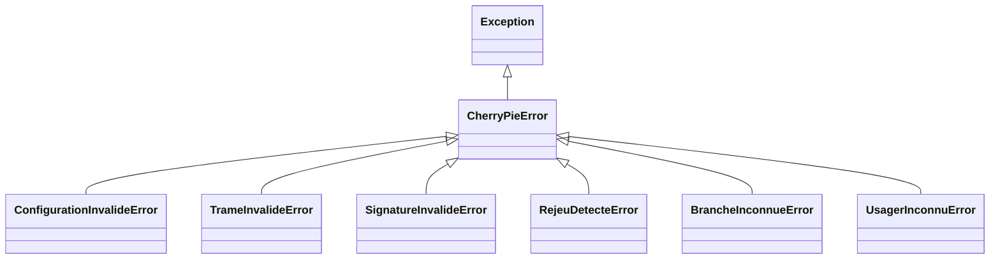
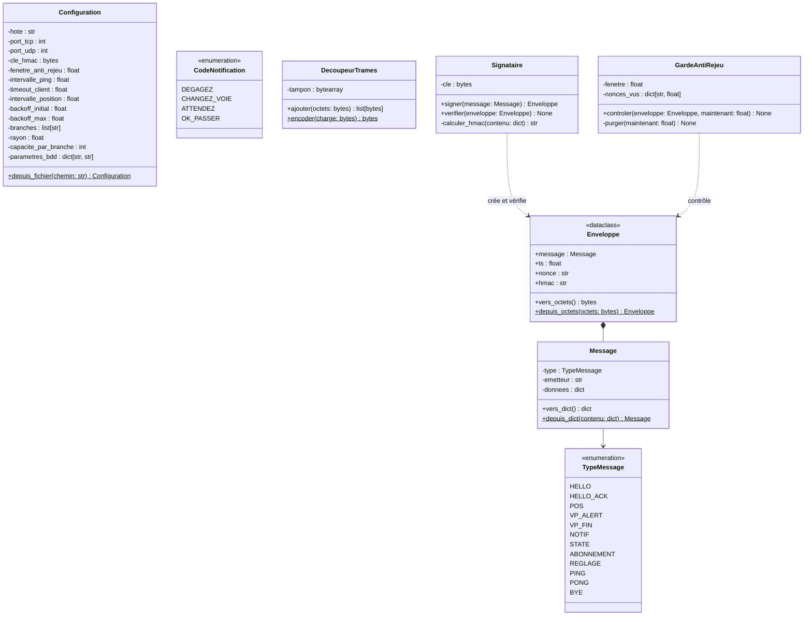
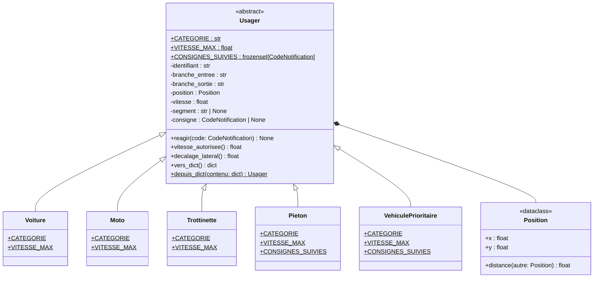
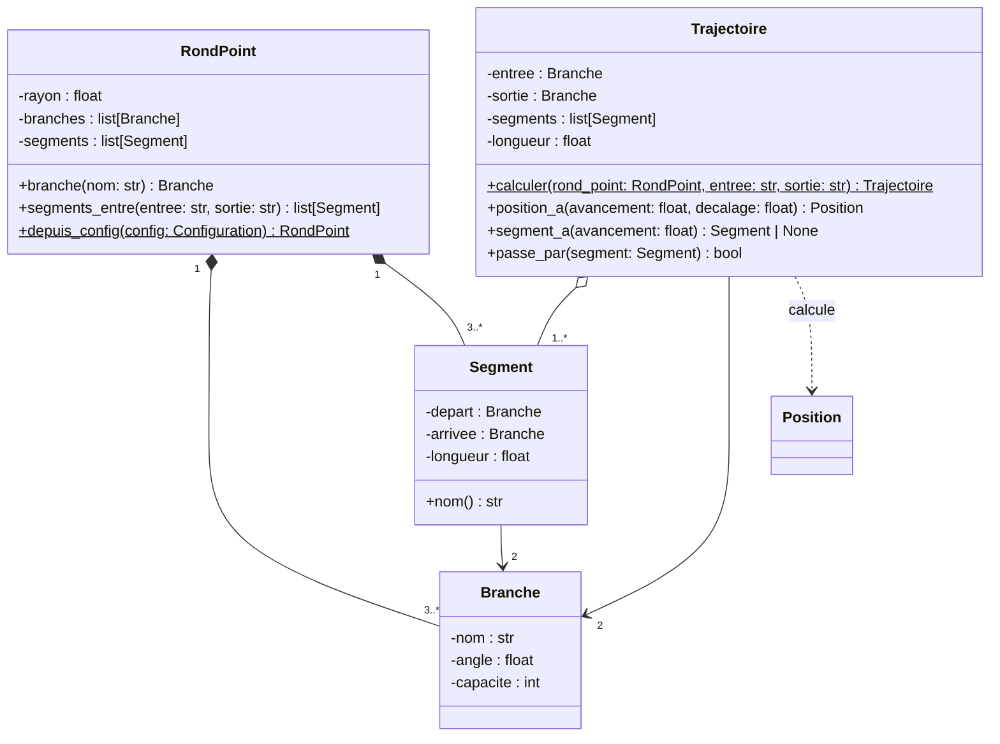

# Diagramme de classes prévisionnel

Ce document décrit les classes prévues avant le développement. Il sera ajusté au fil de l'avancement, le diagramme final étant celui du code rendu.

Dépendances entre paquets : `commun` ne dépend d'aucun autre paquet ; `modele` utilise `commun` ; `serveur` et `client` utilisent `commun` et `modele` ; `ihm` lance des clients et lit la base ; seul `serveur` écrit dans `bdd`.

## Conventions

| Notation | Signification | En Python |
| --- | --- | --- |
| `-` | privé | attribut `self.__nom` ou méthode `__nom()` |
| `#` | protégé | méthode `_nom()`, réservée à la classe et à ses sous-classes |
| `+` | public | méthode ou propriété sans préfixe |
| souligné | membre de classe | constante de classe, `@classmethod` ou `@staticmethod` |
| `<<dataclass>>` | objet valeur | `@dataclass(frozen=True)`, champs publics en lecture seule |
| `<<enumeration>>` | énumération | sous-classe de `Enum` |

Tous les attributs d'instance sont privés, sauf les champs des objets valeur. Chacun est lu depuis l'extérieur par une propriété `@property` du même nom. Un setter n'existe que si l'attribut doit changer après la construction : il valide la valeur et lève une exception si elle est incohérente. Les setters prévus sont listés sous chaque diagramme. Les constructeurs ne sont pas représentés.

Relations : triangle vide pour l'héritage, losange plein pour la composition (la partie n'existe pas sans le tout), losange vide pour l'agrégation (le tout référence des objets qui existent sans lui), flèche simple pour l'association, flèche pointillée pour une dépendance ponctuelle.

## Paquet `commun`

### Erreurs métier

Toutes les erreurs du projet héritent de `CherryPieError`. Le serveur peut ainsi distinguer une trame refusée, qu'il journalise puis ignore, d'un vrai bug.

### Configuration, protocole, trames et sécurité

- `Enveloppe` est la forme transmise sur le réseau : le `Message`, plus l'horodatage, le nonce et le HMAC. `Signataire.signer()` la construit ; à la réception, `Signataire.verifier()` puis `GardeAntiRejeu.controler()` la valident.
- `CodeNotification` fait partie du protocole plutôt que du serveur, parce que le client en a besoin pour réagir aux consignes.
- `DecoupeurTrames` tient le tampon d'une socket TCP : `ajouter()` renvoie les trames complètes et garde le reste pour la lecture suivante.

Setters prévus : aucun, ces objets ne changent plus une fois construits.

## Paquet `modele`

### Usagers

`Usager.reagir()` enregistre la consigne reçue si elle fait partie de `CONSIGNES_SUIVIES`, et l'ignore sinon. Chaque sous-classe redéfinit ce qui lui est propre :

| Classe | Catégorie | Vitesse max | Consignes suivies |
| --- | --- | --- | --- |
| `Voiture` | `voiture` | 8,3 m/s (30 km/h) | toutes |
| `Moto` | `moto` | 8,3 m/s (30 km/h) | toutes |
| `Trottinette` | `trottinette` | 5,6 m/s (20 km/h) | toutes |
| `Pieton` | `pieton` | 1,4 m/s (5 km/h) | `ATTENDEZ`, `OK_PASSER` |
| `VehiculePrioritaire` | `vp` | 11,1 m/s (40 km/h) | aucune, c'est lui qu'on laisse passer |

Les vitesses sont des valeurs de départ, à régler pendant les essais. `vitesse_autorisee()` et `decalage_lateral()` traduisent la consigne en cours en mouvement : arrêt pour `ATTENDEZ`, ralentissement et décalage pour `DEGAGEZ`, décalage pour `CHANGEZ_VOIE`. `depuis_dict()` instancie la bonne sous-classe d'après la catégorie reçue dans le HELLO.

### Rond-point et trajectoires

- `RondPoint` crée ses branches et ses segments à partir de la configuration, et ils n'existent pas sans lui : composition. Une `Trajectoire` ne fait que référencer des segments du rond-point : agrégation.
- Les segments suivent le sens de circulation, inverse des aiguilles d'une montre : avec les branches N, E, S et O, `segments_entre("S", "N")` renvoie S-E puis E-N.
- `position_a()` donne la position d'un usager à partir de la distance déjà parcourue sur sa trajectoire ; le décalage sert à s'écarter quand un véhicule prioritaire arrive.

Setters prévus : `Usager.position`, `Usager.vitesse` et `Usager.segment`, mis à jour par le client quand il avance et par le serveur à chaque POS reçu.
